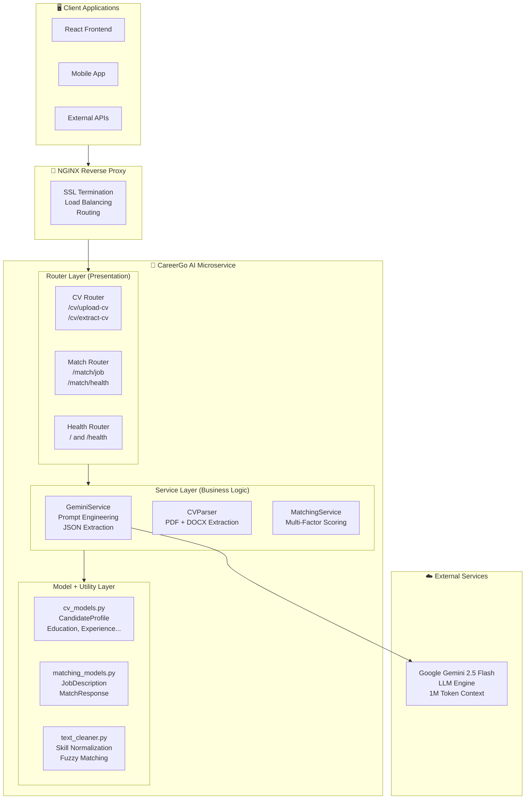
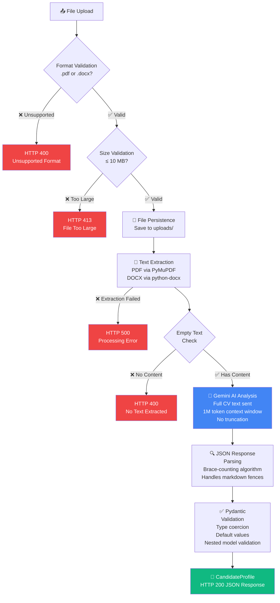
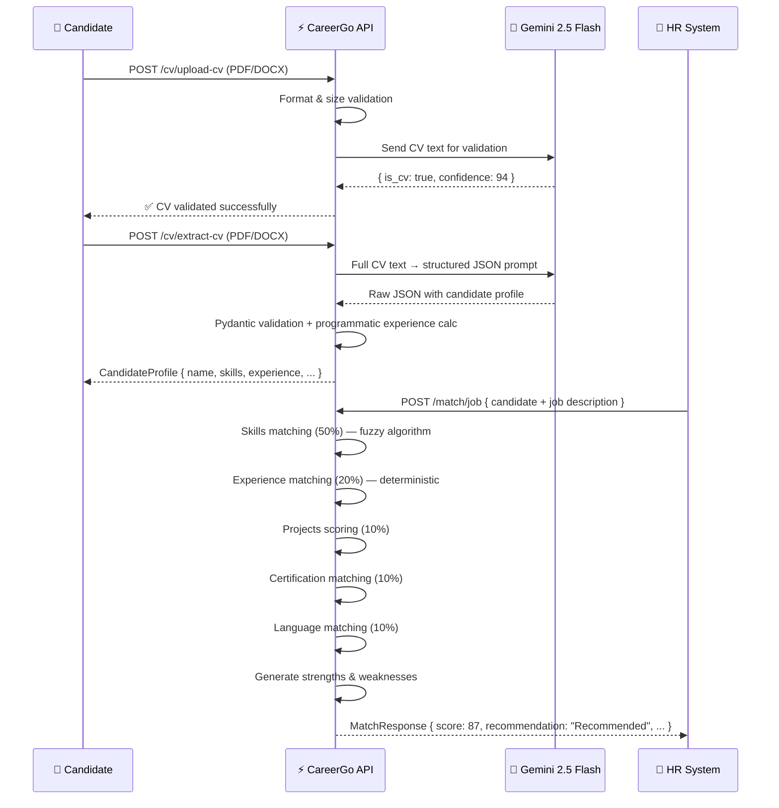

<div align="center">

# 🚀 CareerGo

### AI-Powered CV Analysis & Job Matching System

*A production-ready, cloud-native microservice that automates CV screening, structured data extraction, and intelligent job-candidate compatibility scoring using Large Language Models.*

---


---

🎓 **Graduation Project** · Faculty of Computers & Artificial Intelligence · Benha University · 2026

</div>

---

## 📖 Table of Contents

- [Project Overview](#-project-overview)
- [Project Objectives](#-project-objectives)
- [Key Features](#-key-features)
- [System Architecture](#-system-architecture)
- [CV Processing Pipeline](#-cv-processing-pipeline)
- [AI Integration](#-ai-integration)
- [Deterministic Experience Calculation](#-deterministic-experience-calculation)
- [Job Matching Algorithm](#-job-matching-algorithm)
- [Technology Stack](#-technology-stack)
- [Project Structure](#-project-structure)
- [API Reference](#-api-reference)
- [Installation Guide](#-installation-guide)
- [Example Workflow](#-example-workflow)
- [Security Features](#-security-features)
- [Performance & Scalability](#-performance--scalability)
- [Future Improvements](#-future-improvements-roadmap)
- [Team](#-team)
- [License](#-license)

---

## 🌟 Project Overview

The modern recruitment landscape is defined by overwhelming application volumes, inconsistent evaluation criteria, and a fundamental inability to scale human judgment efficiently. Organizations routinely receive hundreds — sometimes thousands — of CV submissions for a single role, creating critical bottlenecks that cost companies top talent and cost candidates fair consideration.

**CareerGo** directly addresses these challenges:

| Challenge | Impact | CareerGo's Solution |
|-----------|--------|---------------------|
| Manual CV screening | Hours per candidate | AI-powered extraction in seconds |
| Inconsistent evaluation | Human bias and fatigue | Deterministic, auditable scoring algorithms |
| Unstructured CV data | Cannot be processed automatically | Gemini LLM extracts structured JSON profiles |
| Keyword-only matching | High mismatch rates | Multi-factor weighted compatibility scoring |
| Scaling bottlenecks | Hiring delays | Stateless microservice — horizontally scalable |

Traditional rule-based CV parsers are brittle — they rely on rigid templates that break when confronted with the enormous variety of CV formats, styles, and terminology across industries. CareerGo replaces this brittleness with the semantic intelligence of Google Gemini 2.5 Flash, grounded by deterministic Python business logic for all calculations that require consistency and auditability.

---

## 🎯 Project Objectives

- **Intelligent Automation** — Develop a system that automatically validates and extracts structured candidate profiles from CV documents in multiple formats (PDF, DOCX)
- **Semantic Analysis** — Leverage a Large Language Model (Google Gemini 2.5 Flash) to perform accurate, schema-driven information extraction from unstructured CV text
- **Fair & Consistent Scoring** — Implement a deterministic, multi-factor job-candidate matching algorithm that produces reproducible, explainable compatibility scores
- **Bias Reduction** — Apply identical evaluation criteria across all candidates, eliminating the subjectivity introduced by manual screening
- **Production Readiness** — Deliver comprehensive error handling, input validation, structured logging, and security measures suitable for enterprise deployment
- **Flexible Deployment** — Package the system for containerized deployment using Docker and Docker Compose, with Nginx reverse proxy support
- **Developer-Friendly API** — Expose automatic OpenAPI/Swagger documentation through FastAPI's built-in capabilities
- **Scalable Architecture** — Design a stateless microservice enabling horizontal scaling to handle enterprise-level application volumes
- **Extensible Foundation** — Establish a clean architectural baseline with well-defined extension points for future semantic matching, vector databases, and RAG pipelines

---

## ✨ Key Features

### 📄 CV Analysis
- **PDF Upload & Parsing** — PyMuPDF-powered text extraction handling multi-column layouts, text boxes, headers, and footnotes
- **DOCX Upload & Parsing** — python-docx dual-pass extraction covering both paragraphs and table cells (critical for modern template-based CVs)
- **CV Validation** — Gemini-powered binary classification determining whether an uploaded document is a legitimate professional CV
- **No Text Truncation** — Full CV text sent to Gemini, leveraging its 1-million-token context window for complete extraction

### 🧠 AI-Powered Extraction
Structured extraction of the complete candidate profile:
- **Personal Information** — Name, email, phone, location, LinkedIn, GitHub, portfolio
- **Professional Summary** — Objective statement and career overview
- **Education** — Degree, institution, graduation year
- **Work Experience** — Job title, company, duration, responsibilities
- **Skills** — Technical and soft skills
- **Languages** — Spoken/written languages with proficiency levels
- **Projects** — Name, description, technologies used
- **Certifications** — Name, issuer, date obtained

### 🎯 Smart Job Matching
- **Weighted Compatibility Score** — Integer score from 0–100 with explainable breakdown
- **Fuzzy Skill Matching** — Handles abbreviations (`js` → `javascript`), substrings, and case variations
- **Categorical Recommendations** — Highly Recommended / Recommended / Consider / Not Recommended
- **Strengths & Weaknesses** — Human-readable assessments for recruiters
- **Matched/Missing Analysis** — Lists of matched and missing skills, certifications, and languages

### 🔌 API Services
- **FastAPI REST API** — Async-first, high-performance endpoints
- **Automatic Swagger UI** — Interactive documentation at `/docs`
- **OpenAPI Schema** — Machine-readable spec at `/openapi.json`
- **Structured JSON Responses** — Pydantic-validated, type-safe outputs

---

## 🏗️ System Architecture

### High-Level Architecture



### Layered Architecture

The system follows **Clean Architecture** principles, separating concerns across four layers:

| Layer | Module | Responsibility |
|-------|--------|----------------|
| **Presentation** | `routers/cv.py`, `routers/matching.py` | HTTP concerns: receive, validate, delegate, respond |
| **Service** | `services/gemini_service.py`, `services/cv_parser.py`, `services/matching_service.py` | Business logic and external integrations |
| **Model** | `models/cv_models.py`, `models/matching_models.py` | Data contracts, Pydantic validation, OpenAPI schema |
| **Utility** | `utils/text_cleaner.py` | Pure stateless helper functions |

> The Router Layer contains **no business logic** — it acts as a thin HTTP translation layer. This ensures that all business rules remain independently testable.

---

## 🔄 CV Processing Pipeline



### Pipeline Stages

| Stage | Description | Failure Response |
|-------|-------------|-----------------|
| **1. Format Validation** | Extension checked against `{'.pdf', '.docx'}` before any binary read | `HTTP 400` |
| **2. Size Validation** | Content length enforced ≤ 10 MB (10,485,760 bytes) | `HTTP 413` |
| **3. File Persistence** | Saved to `uploads/` directory; created if absent | `HTTP 500` |
| **4. Text Extraction** | PDF: PyMuPDF page-by-page; DOCX: paragraph + table cell dual-pass | `HTTP 500` |
| **5. AI Analysis** | Full text submitted to Gemini 2.5 Flash with structured prompt | Logged |
| **6. JSON Parsing** | Brace-counting extraction handles preamble and markdown fences | `HTTP 400` |
| **7. Pydantic Validation** | Type coercion, optional field defaults, nested model validation | `HTTP 400` |

---

## 🤖 AI Integration

### Gemini API Integration Architecture

The `GeminiService` class wraps the `google-generativeai` Python SDK. The service is instantiated **per-request** (not as a global singleton), ensuring that API key changes and configuration updates are picked up without requiring a service restart. The model identifier `gemini-2.5-flash` is pinned to ensure predictable behavior.

### Prompt Engineering Strategy

The prompts follow structured prompt engineering principles designed to maximize consistency and accuracy:

**CV Validation Prompt** — Instructs Gemini to make a binary determination (is this a CV?) with a confidence percentage and human-readable reason. Both `true` and `false` schemas are provided as examples.

**CV Extraction Prompt** employs four key techniques:
- **Schema specification** — Complete target JSON structure with field names, types, and nesting shown as a filled example
- **Example values** — Concrete placeholders (`'John Doe'`, `'+1234567890'`) instead of abstract type descriptions
- **Negative instructions** — Explicit guidance on absent information: *"If information is not found, use empty strings or empty arrays"*
- **Output constraint** — *"Return ONLY JSON, no other text"* to minimize non-JSON content

### Structured JSON Generation

A critical design principle: **Gemini is tasked exclusively with information extraction** — identifying and structuring information that *exists* in the CV. Gemini does not perform calculations, make inferences, or generate information absent from the source document.

### Robust JSON Extraction

The `_extract_json()` method uses a **brace-counting algorithm** to locate and extract the first valid JSON object from the LLM response, regardless of surrounding content (preamble text, markdown code fences, trailing commentary). This provides resilience against the practical reality that LLMs do not always return perfectly formatted output.

---

## 🔢 Deterministic Experience Calculation

> **This is one of the strongest architectural decisions in the project.**

### The Problem with LLM-Based Calculation

It would be technically simple to ask Gemini to calculate total years of experience directly. However, doing so would introduce **LLM variability** into a field that must be consistent and auditable.

### Our Approach: Programmatic Calculation

Total years of work experience in `CandidateProfile` are **NOT calculated by Gemini**.

- ✅ **Gemini's role**: Extract individual work experience records — job title, company, and the raw duration text (e.g., `"2 years"`, `"3+ years"`, `"1 year 6 months"`)
- ✅ **Python's role**: The `extract_years_from_text()` utility function uses regex pattern matching to parse these duration strings into numeric values, which are then summed to compute `total_experience_years`

### Why This Matters

| Aspect | LLM-Based Calculation | Programmatic Calculation ✅ |
|--------|----------------------|---------------------------|
| **Consistency** | May vary between calls for identical input | Identical output for identical input, every time |
| **Transparency** | Black-box reasoning, not auditable | Deterministic code, fully auditable |
| **Edge Cases** | May misinterpret overlapping periods | Handles gaps and overlaps with explicit logic |
| **Testability** | Requires live API calls for testing | Pure function, testable without network |
| **Cost** | Increases token usage and API cost | Zero additional cost |
| **Latency** | Increases LLM inference time | Executes in microseconds |

This separation ensures that the `total_experience_years` field — critical to the 20% weighted experience score — is computed with complete reliability, independent of LLM variability.

---

## ⚖️ Job Matching Algorithm

### Scoring Formula

```
Final Score = (Skills Score × 50) + (Experience Score × 20)
            + (Projects Score × 10) + (Certificate Score × 10)
            + (Language Score × 10)

Where each sub-score ∈ [0.0, 1.0]
Final Score ∈ [0, 100] (integer, rounded)
```

### Scoring Component Weights

| Component | Weight | Scoring Logic |
|-----------|--------|---------------|
| 🛠️ **Skills** | **50%** | Fuzzy match: exact (1.0), substring (0.8), abbreviation (0.8), none (0.0). Threshold: 0.8 |
| 📅 **Experience** | **20%** | `min(candidate_years / required_years, 1.0)` — over-qualification not penalized |
| 💡 **Projects** | **10%** | Matched if any required skill appears in project name + description + technologies |
| 🏆 **Certifications** | **10%** | Case-insensitive substring match; score = 1.0 if none preferred |
| 🌐 **Languages** | **10%** | Case-insensitive substring match after normalization; score = 1.0 if none required |

### Weight Rationale

| Factor | Weight | Rationale |
|--------|--------|-----------|
| Skills | 50% | Technical skills are the primary determinant of job performance capability; directly measurable |
| Experience | 20% | Years of experience correlates with depth of knowledge and practical exposure |
| Projects | 10% | Demonstrates applied skills beyond theoretical knowledge; evidences hands-on capability |
| Certifications | 10% | Preferred (not required); validates structured learning and professional commitment |
| Languages | 10% | Ensures communication capability with team and stakeholders |

### Recommendation Thresholds

| Score Range | Recommendation | Interpretation |
|-------------|----------------|----------------|
| 90 – 100 | 🟢 **Highly Recommended** | Meets or exceeds all criteria; ideal match — advance immediately |
| 75 – 89 | 🔵 **Recommended** | Meets most criteria with minor gaps; strong consideration |
| 60 – 74 | 🟡 **Consider** | Meets core criteria but has notable gaps; evaluate case-by-case |
| 0 – 59 | 🔴 **Not Recommended** | Significant skill or experience gaps; does not meet minimum requirements |

### Skill Abbreviation Mapping

The `text_cleaner.py` module maintains an abbreviation dictionary preventing artificial penalization of candidates using common industry shorthand:

```
js → javascript    ts → typescript    py → python
k8s → kubernetes   ml → machine learning    ai → artificial intelligence
```

---

## 🛠️ Technology Stack

| Technology | Version | Role | Notes |
|------------|---------|------|-------|
| 🐍 **Python** | 3.11+ | Core language | Modern typing, async support |
| ⚡ **FastAPI** | 0.104.1 | Web framework & API layer | Async-native, auto OpenAPI |
| 🤖 **Google Gemini 2.5 Flash** | Latest | AI/LLM engine | 1M token context window |
| 📄 **PyMuPDF (fitz)** | 1.23.8 | PDF text extraction | Handles complex layouts |
| 📝 **python-docx** | 0.8.11 | DOCX text extraction | Paragraph + table cell extraction |
| ✅ **Pydantic** | 2.5.0 | Data validation & serialization | Type-safe contracts |
| 🚀 **Uvicorn** | 0.24.0 | ASGI server | Production-grade async server |
| 🐳 **Docker** | Latest | Containerization | Reproducible deployments |
| 🔀 **Nginx** | Latest | Reverse proxy & load balancing | SSL termination, routing |
| 📦 **Docker Compose** | Latest | Multi-container orchestration | Service coordination |

---

## 📁 Project Structure

```
ai_service/
├── app/
│   ├── __init__.py                 # Package initializer; version metadata
│   ├── main.py                     # FastAPI app factory; CORS, routers, lifecycle
│   │
│   ├── routers/
│   │   ├── __init__.py
│   │   ├── cv.py                   # POST /cv/upload-cv, POST /cv/extract-cv
│   │   └── matching.py             # POST /match/job, GET /match/health
│   │
│   ├── services/
│   │   ├── __init__.py
│   │   ├── gemini_service.py       # Gemini API integration; prompting; JSON extraction
│   │   ├── cv_parser.py            # PDF (PyMuPDF) + DOCX (python-docx) extraction
│   │   └── matching_service.py     # Multi-factor scoring algorithm; strengths/weaknesses
│   │
│   ├── models/
│   │   ├── __init__.py
│   │   ├── cv_models.py            # CandidateProfile, Education, Experience, Project, Certification
│   │   └── matching_models.py      # JobDescription, MatchRequest, MatchResponse, DetailedMatchScore
│   │
│   └── utils/
│       ├── __init__.py
│       └── text_cleaner.py         # Pure functions: normalize_skills, calculate_skill_similarity
│
├── uploads/                        # Uploaded CV file storage (gitignored)
├── requirements.txt                # Python dependencies
├── Dockerfile                      # Container definition (python:3.11-slim)
├── docker-compose.yml              # Orchestrates ai-service + nginx
├── nginx.conf                      # Reverse proxy configuration
├── .env                            # Runtime secrets (not in VCS)
└── .env.example                    # Configuration template
```

---

## 📡 API Reference

### Base URL

| Environment | URL |
|-------------|-----|
| Development | `http://localhost:8000` |
| Production | `https://api.yourdomain.com` |
| Swagger UI | `http://localhost:8000/docs` |
| OpenAPI JSON | `http://localhost:8000/openapi.json` |

### Common Response Codes

| Code | Status | Trigger Conditions |
|------|--------|--------------------|
| `200 OK` | Success | Request processed successfully |
| `400 Bad Request` | Validation Error | Invalid file format, not a CV, Pydantic failure |
| `413 Entity Too Large` | File Size Error | Uploaded file exceeds 10 MB |
| `500 Internal Server Error` | Processing Error | Unhandled exception; check server logs |

### Endpoints

#### `GET /`
Returns service information and available endpoint map.

**Response:**
```json
{
  "service": "CareerGo AI Microservice",
  "version": "1.0.0",
  "docs": "/docs",
  "endpoints": { ... }
}
```

---

#### `GET /health`
Global service health check for load balancers and monitoring systems.

**Response:**
```json
{ "status": "ok", "service": "CareerGo AI Microservice", "version": "1.0.0" }
```

---

#### `POST /cv/upload-cv`
Validate whether an uploaded document is a legitimate professional CV/Resume.

| Attribute | Value |
|-----------|-------|
| Content-Type | `multipart/form-data` |
| Parameter | `file` (required) — PDF or DOCX, max 10 MB |
| Processing | Text extraction → Gemini CV classification → structured validation result |
| Side Effect | Invalid CV files are immediately deleted from the server |

**Response 200:**
```json
{ "is_cv": true, "confidence": 95, "reason": "Professional CV with clear sections" }
```

**Response 400 (not a CV):**
```json
{ "detail": "Document is not a professional CV/Resume: [reason]" }
```

---

#### `POST /cv/extract-cv`
Extract a complete structured candidate profile from a CV document.

| Attribute | Value |
|-----------|-------|
| Content-Type | `multipart/form-data` |
| Parameter | `file` (required) — PDF or DOCX, max 10 MB |
| Processing | Text extraction → Full Gemini extraction → Pydantic validation → `CandidateProfile` |
| Key Field | `total_experience_years` computed programmatically from experience duration entries |

**Response 200:** Full `CandidateProfile` JSON object (see Data Models section)

---

#### `POST /match/job`
Calculate compatibility score between a candidate profile and a job description.

| Attribute | Value |
|-----------|-------|
| Content-Type | `application/json` |
| Request Body | `MatchRequest`: `{ candidate: CandidateProfile, job: JobDescription }` |
| Processing | Profile parsing → multi-factor scoring → strengths/weaknesses → `MatchResponse` |
| Scoring Weights | Skills 50%, Experience 20%, Projects 10%, Certifications 10%, Languages 10% |

**Response 200:** `MatchResponse` JSON with `match_score`, `recommendation`, matched/missing skills, certifications, languages, strengths, and weaknesses.

---

#### `GET /match/health`
Matching service-specific health check for fine-grained monitoring.

**Response:**
```json
{ "status": "ok", "message": "Job matching service is operational" }
```

---

## 🚀 Installation Guide

### Prerequisites
- Python 3.11+
- Docker & Docker Compose (for containerized deployment)
- A [Google AI Studio](https://aistudio.google.com) API key

---

### Option 1: Local Development Setup

**Step 1 — Clone the repository**
```bash
git clone https://github.com/your-org/careergo.git
cd careergo/ai_service
```

**Step 2 — Create and activate virtual environment**
```bash
python -m venv venv
source venv/bin/activate        # Linux / macOS
venv\Scripts\activate           # Windows
```

**Step 3 — Install dependencies**
```bash
pip install -r requirements.txt
```

**Step 4 — Configure environment variables**
```bash
cp .env.example .env
# Open .env and add: GEMINI_API_KEY=your_key_here
```

**Step 5 — Run the development server**
```bash
python -m uvicorn app.main:app --reload --host 0.0.0.0 --port 8000
```

**Step 6 — Access Swagger UI**

Open your browser at [http://localhost:8000/docs](http://localhost:8000/docs) to explore the interactive API documentation.

---

### Option 2: Docker Deployment

**Build and run the container**
```bash
docker build -t careergo-ai-service .
docker run -p 8000:8000 \
  -e GEMINI_API_KEY=your_key_here \
  careergo-ai-service
```

---

### Option 3: Docker Compose (Recommended for Production)

```bash
# Set your API key in the environment
export GEMINI_API_KEY=your_key_here

# Start the full stack (AI service + Nginx)
docker-compose up -d

# View logs
docker-compose logs -f ai-service

# Stop all services
docker-compose down
```

The stack will be available at `http://localhost` (port 80 via Nginx) and `http://localhost:8000` (direct FastAPI).

---

### Environment Variables

| Variable | Required | Default | Description |
|----------|----------|---------|-------------|
| `GEMINI_API_KEY` | ✅ Yes | — | Google AI Studio API key |
| `SERVER_HOST` | No | `0.0.0.0` | Uvicorn bind address |
| `SERVER_PORT` | No | `8000` | Uvicorn listen port |
| `DEBUG` | No | `False` | Enable debug mode and verbose logging |

---

## 🔁 Example Workflow



**Step-by-step:**

1. 📤 **Candidate uploads CV** — PDF or DOCX submitted via `POST /cv/upload-cv`
2. ✅ **Validation** — Format, size, and Gemini CV classification checks pass
3. 🧠 **AI Extraction** — `POST /cv/extract-cv` triggers full Gemini analysis; structured `CandidateProfile` returned
4. 📋 **Job Requirements Submitted** — HR system submits `JobDescription` with required skills, experience, certifications, and languages to `POST /match/job`
5. ⚖️ **Multi-Factor Matching** — Deterministic scoring algorithm evaluates all five components
6. 📊 **Results Returned** — `MatchResponse` with score, recommendation, matched/missing analysis, and human-readable strengths and weaknesses

---

## 🔒 Security Features

### Defense-in-Depth Strategy

| Layer | Mechanism | Implementation |
|-------|-----------|----------------|
| **Input Validation** | File format check | Extension must be `.pdf` or `.docx` before binary read |
| **Input Validation** | File size limit | 10 MB maximum enforced before processing |
| **Input Validation** | JSON body validation | Pydantic auto-validates all request bodies |
| **File Handling** | Automatic cleanup | Invalid CV files deleted immediately after Gemini rejection |
| **File Handling** | Library exception handling | fitz/docx exceptions caught; malformed files handled gracefully |
| **API Key Protection** | Environment variables | `GEMINI_API_KEY` loaded from `.env` via python-dotenv |
| **API Key Protection** | `.gitignore` enforcement | `.env` excluded from version control |
| **API Key Protection** | Docker secrets | API key passed as `--env` flag, never baked into image |
| **Error Sanitization** | Generic external messages | Full stack traces logged server-side; sanitized summaries returned to clients |
| **CORS Protection** | CORSMiddleware | Currently `*` for development; replace with origin allowlist for production |
| **Output Validation** | Pydantic constraints | `match_score: int, ge=0, le=100` enforced on all responses |

> ⚠️ **Production Note:** Replace `allow_origins=["*"]` with your specific frontend domains before deploying to production.

---

## ⚡ Performance & Scalability

### Latency Profile

| Operation | Typical Latency | Bottleneck |
|-----------|----------------|------------|
| CV text extraction (PDF) | 50–200 ms | File I/O + PyMuPDF processing |
| CV text extraction (DOCX) | 30–100 ms | python-docx parsing |
| Gemini CV validation | 800–2,000 ms | External API network + LLM inference |
| Gemini CV extraction | 2,000–5,000 ms | External API network + full document inference |
| Job matching algorithm | 5–50 ms | Pure Python computation |
| **Total `/cv/extract-cv`** | **2.5–7 seconds** | Dominated by Gemini latency |
| **Total `/match/job`** | **10–100 ms** | Python computation only |

### FastAPI Async Performance

FastAPI's async-first design means that while one request awaits a Gemini API response (a network I/O operation), the event loop concurrently processes other incoming requests without requiring additional threads. All router handlers are defined as `async def`, ensuring file uploads and AI calls do not block.

### Scalability Strategy

**Stateless by Design** — No in-memory session state is shared between requests. Multiple identical instances can be deployed behind a load balancer with zero coordination overhead.

**Horizontal Scaling:**
```bash
# Multi-worker production startup
uvicorn app.main:app --host 0.0.0.0 --port 8000 --workers 4

# Kubernetes: deploy N replicas behind a service
kubectl scale deployment careergo-ai --replicas=8
```

**Gemini Rate Limit Optimization:**
- **Caching** — Store extraction results keyed by file hash; identical CVs skip re-extraction
- **Retry Logic** — Exponential backoff for HTTP 429 responses
- **Tier Upgrade** — Paid Gemini tier for high-volume production workloads

---

## 🛣️ Future Improvements Roadmap

### Near-Term Enhancements

| Feature | Description | Impact |
|---------|-------------|--------|
| 🔍 **Semantic Skill Matching** | Replace string comparison with sentence transformer vector embeddings; cosine similarity enables `"REST API development"` to match `"RESTful web services"` | High accuracy improvement |
| 🗃️ **Vector Database Integration** | Pinecone, Weaviate, or pgvector for persistent candidate embeddings and approximate nearest-neighbor search | Transforms tool to full candidate ranking system |
| 📚 **RAG-Enhanced Extraction** | Inject domain-specific knowledge base (technical skills, certification names) into Gemini prompt context | Reduces hallucination; improves extraction for niche domains |

### Medium-Term Enhancements

| Feature | Description | Benefit |
|---------|-------------|---------|
| 🔄 **Multi-LLM Support** | Abstract LLM provider; support GPT-4, Claude, and local models | Vendor independence, cost optimization |
| 📊 **Persistent Storage** | Database for candidate profiles and match history | Analytics, audit trail, historical reporting |
| 🔁 **Retry Logic** | Exponential backoff for Gemini API rate limit failures | Improved reliability under load |
| 🛡️ **Rate Limiting** | Per-IP request throttling via Redis | Prevent abuse; ensure fair usage |
| 🤖 **ATS Compatibility Scoring** | Analyze CVs against ATS keyword requirements | Help candidates optimize for automated screening |
| ⚡ **True Async Gemini Calls** | Replace synchronous SDK with async HTTP client | Higher concurrent throughput |

### Long-Term Vision

```mermaid
gantt
    title CareerGo Enhancement Roadmap
    dateFormat  YYYY-Q[Q]
    axisFormat  %Y Q%q

    section Near-Term
    Semantic Skill Matching       :active, 2026-Q3, 90d
    Vector Database (Pinecone)    :2026-Q3, 90d
    RAG-Enhanced Extraction       :2026-Q4, 90d

    section Medium-Term
    Multi-LLM Support             :2026-Q4, 120d
    Persistent Storage + Analytics:2027-Q1, 90d
    Rate Limiting + Retry Logic   :2027-Q1, 60d

    section Long-Term
    Analytics Dashboard           :2027-Q2, 120d
    Candidate Recommendation Eng  :2027-Q2, 120d
    Multilingual CV Processing    :2027-Q3, 90d
    Cloud-Native Kubernetes Deploy:2027-Q3, 90d
    CI/CD Pipeline Automation     :2027-Q4, 60d
    Mobile Application Support    :2027-Q4, 120d
```

**Long-term vision features:**
- 📈 **Analytics Dashboard** — Real-time visualization of candidate pipeline metrics, skill gap analysis, and match score distributions
- 🎯 **Candidate Recommendation Engine** — Proactively surface top candidates from a stored pool for new job openings
- 🌍 **Multilingual CV Processing** — Arabic, French, German, and other language support
- ⚖️ **Bias Detection** — Analyze match scoring patterns for systematic bias in job requirements or scoring weights
- 👁️ **Multi-modal Processing** — Vision AI support for image-based and scanned CVs
- 🔄 **Continuous Learning** — Feedback loop from hiring outcomes to ML-optimize scoring weights
- ☸️ **Cloud-Native Kubernetes Deployment** — Full Helm chart and auto-scaling configuration
- 🔒 **Enterprise Features** — SSO, audit logging, role-based access control
- 🔬 **CI/CD Pipeline Automation** — GitHub Actions workflows for testing, building, and deployment

---

## 👥 Team

<div align="center">

### Development Team

| # | Name |
|---|------|
| 1 | Mohamed Shehab ELdeen Khalil |
| 2 | Mohamed Shady Aish |
| 3 | Mahmoud Mostafa Mohamed |
| 4 | Moataz Hamdy Ali |
| 5 | Mostafa Ezzat Abdelnaeem |
| 6 | Saleh Saber Ibrahim |
| 7 | Yousef Mohamed Helmi |
| 8 | Youssef Essam Fawzy |
| 9 | Yassen Saeed Yassen |

### Supervisors

| Role | Name |
|------|------|
| 👩‍🏫 Academic Supervisor | **Dr. Eman Monier** |
| 👩‍💻 Technical Supervisor | **Eng. Sara Reda** |

### Institution

🎓 **Faculty of Computers & Artificial Intelligence**
**Benha University** · Scientific Computing Department · June 2026

</div>

---

## 📄 License

This project is developed as a graduation project for academic purposes at Benha University, Faculty of Computers & Artificial Intelligence.

```
MIT License

Copyright (c) 2026 CareerGo Team — Benha University

Permission is hereby granted, free of charge, to any person obtaining a copy
of this software and associated documentation files (the "Software"), to deal
in the Software without restriction, including without limitation the rights
to use, copy, modify, merge, publish, distribute, sublicense, and/or sell
copies of the Software, and to permit persons to whom the Software is
furnished to do so, subject to the following conditions:

The above copyright notice and this permission notice shall be included in all
copies or substantial portions of the Software.

THE SOFTWARE IS PROVIDED "AS IS", WITHOUT WARRANTY OF ANY KIND, EXPRESS OR
IMPLIED, INCLUDING BUT NOT LIMITED TO THE WARRANTIES OF MERCHANTABILITY,
FITNESS FOR A PARTICULAR PURPOSE AND NONINFRINGEMENT.
```

---

<div align="center">

**Built with ❤️ by the CareerGo Team · Benha University · 2026**

*Bridging talent with opportunity through the power of AI*

</div>
